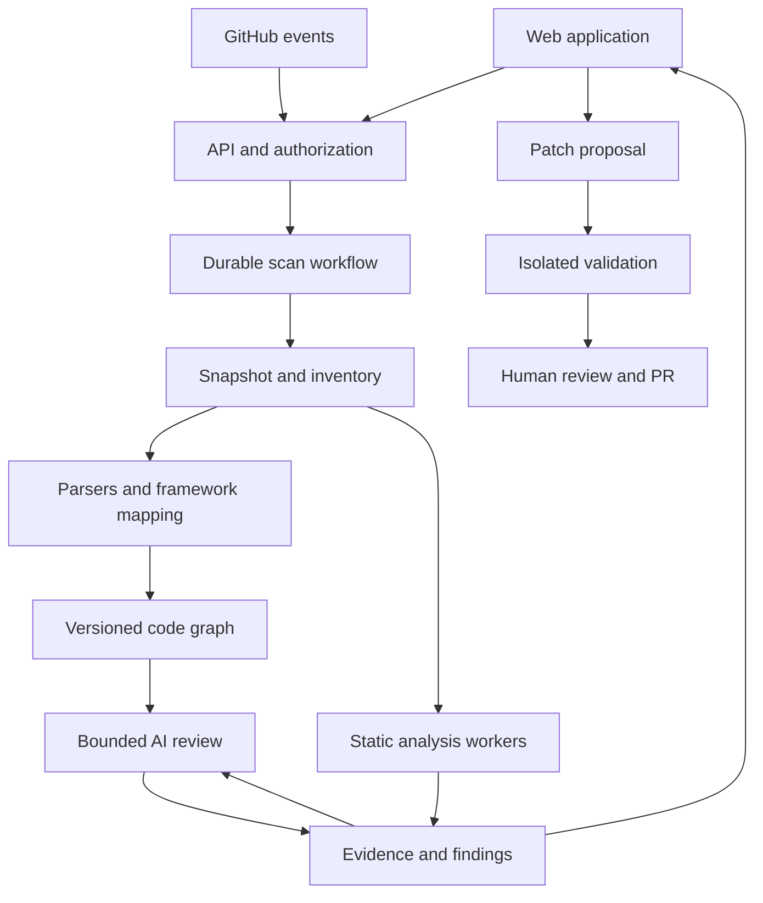

# Agentic Code Review and Code Intelligence Platform

Research findings, proposed architecture, and delivery roadmap  
Prepared: 25 September 2026

## 1. Recommendation and scope

Build a framework-aware code intelligence and remediation platform that combines deterministic analysis, persistent repository mappings, bounded AI investigation, and independently validated fixes. Reuse existing engines through adapters; own the product experience, evidence model, framework knowledge, orchestration, and validation workflow.

The strongest initial proposition is: **Understand a large enterprise codebase, identify actionable problems with evidence, explain their impact, and produce reviewable fixes with recorded validation.**

Recommended launch scope:

- GitHub integration; whole-repository baseline scans and incremental pull-request scans.
- Java and JavaScript/TypeScript as the first general-purpose languages.
- SAP Commerce as the first deep framework specialization, followed by Salesforce Apex, LWC, and metadata.
- A dashboard covering architecture, issues, scan coverage, and fix validation.
- Optional customer-hosted runners for proprietary source, licensed dependencies, and platform testing.
- Human-controlled pull requests; no automatic production deployment or unrestricted repository rewriting.

This document is a researched design, not an implemented application or a benchmark of a working product. Official documentation, public repositories, and selected Alibaba implementation files were inspected. No customer code was supplied, no engines were executed against a customer project, and no performance claims have been independently measured. Timelines and service targets below are planning estimates.

Assumptions: a potential commercial product, a small dedicated engineering team, access to representative private repositories during a pilot, and GitHub as the first source provider. An internal-only deployment may have different licensing options, but those rights must not be assumed to transfer to a commercial service.

## 2. What can and cannot be promised

“Scan the complete codebase” should mean that every discovered file is accounted for and that each applicable analyzer records its coverage. It cannot mean that every possible defect is detectable or that an LLM fully understands every business requirement.

Offer three explicit analysis levels:

| Level | Available evidence | Result |
|---|---|---|
| Source | Files, manifests, metadata, static rules, syntax and partial symbol resolution | Useful without a successful build; semantic and runtime gaps disclosed |
| Build | Correct compiler, dependencies, generated sources, bytecode, tests | Better type resolution, deeper analysis, verified compilation |
| Runtime | Authorized test environment, representative data, traces and profiles | Reproduction and measurement of selected runtime, permission and performance issues |

Keep separate counts for discovered, eligible, excluded, parsed, type-resolved, statically analyzed, AI-reviewed, failed, and unsupported files. A file read for AI context is not necessarily reviewed. An empty scanner response is not evidence of success unless the process and coverage manifest confirm completion.

Static tools can flag a likely expensive query or repeated database call. A claim such as “checkout is 30% faster” requires repeatable runtime measurements. Dead-code candidates require checking reflection, Spring wiring, configuration, scheduled execution, metadata, and external callers before deletion.

The product should provide the **best-supported recommendation under known constraints**, including alternatives, assumptions, compatibility and tests, rather than promise a universally best solution.

Use a published capability matrix for each language/framework version:

| Review family | Candidate scenarios | Evidence needed beyond patterns |
|---|---|---|
| Correctness | Null handling, resource cleanup, error paths, boundary conditions | Types, contracts, control flow, regression tests |
| Performance | Repeated queries, excessive allocations, blocking I/O, unbounded work | Data volumes, query plans, profiles and load tests for measured claims |
| Concurrency | Shared mutable state, race/deadlock candidates, transaction boundaries | Execution model and targeted concurrent tests |
| Security | Injection, broken authorization, unsafe deserialization, sensitive data exposure | Source-to-sink flow and actual security context |
| Maintainability | Duplication, complexity, hard-coded values, inconsistent error handling | Team standards and behavior-preserving transformations |
| Architecture | Dependency cycles, layer violations, tight coupling | Resolved module graph and agreed architecture rules |
| Supply chain | Vulnerable dependencies, license obligations, unsafe containers/IaC | Accurate resolved dependency inventory and current advisory data |
| API/integration | Contract drift, missing timeouts, retry amplification, idempotency | Consumer contracts and integration tests |
| Tests | Missing relevant tests, weak assertions, flaky behavior | Coverage/execution evidence and expected business behavior |
| Operations | Unsafe logging, missing diagnostic context, fragile job recovery | Operational requirements and representative failure testing |
| UI | Framework misuse, client-side data exposure, accessibility candidates | Component tests and rendered/runtime assessment |
| Business logic | Order totals, inventory reservation, permissions, approval rules | Explicit requirements, invariants and domain-owner validation |

Mark every capability as supported, conditional, experimental or unsupported. This matrix—not a generic “supports Java” badge—defines the product’s actual review scope.

## 3. Market position and differentiation

The broad idea is already a competitive category. CodeRabbit documents repository context, code graphs, fixes and integrations with analysis tools [S10]. Sonar provides established analysis and governance products [S07]. Open-source projects cover AI review, code graphs, static rules, and transformation.

Therefore, “LLM plus dashboard” is insufficient differentiation. Validate these product hypotheses with enterprise teams:

1. Deep SAP Commerce and Salesforce mappings spanning code and declarative configuration.
2. Evidence-backed explanations connecting a finding to an endpoint, business journey, object, job or integration.
3. Private execution within customer infrastructure, including licensed platform dependencies.
4. Honest coverage reporting, low-noise prioritization, and reproducible validation.
5. Combined modernization and maintenance workflows for large existing applications.

The commercial buyer may be a platform engineering leader, engineering manager, enterprise architect, application security team or implementation partner. Developers need precise findings and patches; architects need dependency and impact maps; managers need trends and ownership. Avoid individual developer leaderboards based on issue counts.

Suggested commercial model: a workspace or repository tier with included analysis capacity, separately metered expensive validation or AI usage, and enterprise options for private runners and data controls. Validate pricing with pilots; do not price unlimited full-repository AI review as a negligible-cost feature.

## 4. Assessment of alibaba/open-code-review

Repository: [alibaba/open-code-review](https://github.com/alibaba/open-code-review). GitHub inspection used commit `486022daaf14f7142275eddb9b3cacc3cc5dadfa`, committed on 24 September 2026.

The README describes a Go-based AI review CLI with deterministic file selection and grouping, configurable model access, code-reading/search tools, structured comments and full-file scanning through `ocr scan` [S01]. Its published quality and token-efficiency results are the maintainers’ benchmark claims, not proof of performance on SAP Commerce or Salesforce.

Selected implementation inspection confirmed that the full-scan path exposes concurrency, timeouts, resume state, token budgets, filtering, and optional plan/deduplication/summary stages [S02]. These are useful mechanisms, but do not establish semantic completeness or a production SaaS service.

The project also has a session viewer. Its documented issue marks are browser-local state; its server routes are read-only. It is useful for inspecting reviews, but does not provide the shared issue workflow this application needs [S03].

| Area | Reuse decision |
|---|---|
| AI review execution | Strong candidate for an isolated engine adapter |
| Full-file and diff review | Evaluate both on representative repositories |
| Rule selection and review context | Reuse where verified; extend through controlled configuration |
| Browser session viewer | Reference/demo utility; build the product dashboard separately |
| Persistent semantic graph | Build or integrate separately; not established by this inspection |
| Multi-tenant authorization and governance | Product responsibility |
| Cross-engine deduplication and issue history | Product responsibility |
| Validated multi-file fixes | Product responsibility |
| SAP/Salesforce expertise | Dedicated adapters and evaluated rule packs |

**Integration approach:** pin an approved release or commit in a worker image; invoke the CLI with a controlled configuration; normalize structured results; capture coverage, failures, runtime and model usage. Contract-test the JSON schema and exit behavior before upgrades. Prefer this to depending on Go `internal/` packages as a stable public SDK.

Use isolated per-job user configuration and session directories. Treat transcripts as source-bearing sensitive artifacts. Repository files must not be allowed to select arbitrary model endpoints, credential commands or MCP tools. Verify that the pinned version can enforce these boundaries; otherwise add a narrowly scoped wrapper or patch, or choose another engine.

The top-level project license is Apache-2.0 [S01]. Include dependency and asset licenses, notices, security posture, release provenance and upgrade ownership in an exact-version adoption review. The repository is a promising component; it is not a complete foundation for every requirement.

## 5. Open-source and commercial foundation choices

License observations are point-in-time facts about the inspected upstream material. An engine’s license does not automatically cover all its rules, plugins, datasets, packages or hosted services. A process/container boundary is useful engineering separation, not an automatic licensing exemption.

| Component | Proposed role | Current licensing/maintenance observation | Decision |
|---|---|---|---|
| Alibaba Open Code Review | AI full-file and PR review | Apache-2.0 at inspected repository | Primary AI review candidate [S01–S03] |
| Opengrep | Multi-language pattern and taint rules; JSON/SARIF | LGPL-2.1 engine; rule licenses need separate inspection | Pilot as primary general SAST engine [S04] |
| Semgrep CE | Alternative rule engine | LGPL-2.1 engine; Semgrep-maintained rules restrict competing products/SaaS | Use own or cleared rules, or arrange suitable rights [S05] |
| PMD / CPD | Java/Apex rules and duplication | BSD-style upstream license | Core adapter; create domain rules [S11] |
| ESLint | JavaScript/TypeScript and framework linting | MIT engine; inspect each plugin | Core adapter; use trusted configuration [S12] |
| SpotBugs | Java bytecode defect analysis | Requires compiled code for intended analysis | Build-enabled worker; inspect selected distribution license [S13] |
| Salesforce Code Analyzer | Salesforce-specific analysis orchestration | Several bundled engines; audit exact package/engine rights | Preferred Salesforce adapter, with per-engine status [S06] |
| Trivy | Dependencies, containers, IaC, secrets, SBOM | Apache-2.0 repository | Initial supply-chain adapter [S14] |
| Gitleaks CLI | Secret detection in files and Git history | MIT; upstream currently states security patches only | Optional history scanner; assess maintenance and successors [S15] |
| Tree-sitter | Incremental syntax parsing | Core and grammar licenses require package inventory | Structural parsing layer; does not replace type resolution [S16] |
| code-review-graph | Structural graph and compact review context | MIT repository; Tree-sitter-based | Evaluate as graph accelerator; enterprise and domain gaps remain [S17] |
| Joern | Deeper code-property-graph analysis | Apache-2.0 repository; coverage differs by frontend | Later targeted analysis, not mandatory for MVP [S18] |
| OpenRewrite | Repeatable Java transformations | Apache core/original language components; additional modules/recipes may be source-available or proprietary | Use approved Apache components and own recipes first [S19] |
| PR Agent | Alternative PR review implementation | Current URL redirects to The-PR-Agent/pr-agent; inspected current LICENSE is MIT | Benchmark as alternative; do not assume historical snapshots share this license [S20] |
| SonarQube | Customer scanner integration and baseline comparison | Core/binaries and bundled analyzers have different terms; analyzers use SSAL | Avoid using as a competing commercial product core without suitable rights [S07–S08] |
| CodeQL | Optional deeper security analysis | CLI has separate terms; private-repository use requires applicable entitlement | Optional authorized integration; not an unrestricted OSS backend [S09] |

Particularly important: Opengrep’s rule compatibility does not grant permission to reuse restricted Semgrep rules. OpenRewrite’s core license does not grant permission to commercialize every recipe or newer language module. Gitleaks CLI and its GitHub Action should be assessed separately.

For Sonar/CodeQL, a customer’s license or result-export permission must be checked for the intended integration. Sonar’s current SSAL page is version 1.0.1 and also restricts outside AI interacting with the program or its data within its definition of permitted purpose [S08]. Therefore, do not assume that a customer’s Sonar results can be fed to your AI service. Check the exact component version and applicable agreement. Importing authorized reports is a useful design option, not a blanket workaround for their terms.

**Recommended starter combination:** PMD/CPD + ESLint + Opengrep with approved rules + Trivy, with Alibaba OCR as an interchangeable AI review engine. Add framework adapters, build-enabled SpotBugs, and approved transformations as the project matures. Normalize overlapping results so Salesforce Code Analyzer’s embedded PMD/ESLint do not generate duplicate issue counts.

## 6. Product modules and dashboard

| Screen | What users see | Main actions |
|---|---|---|
| Portfolio | Repositories, owners, current scans, serious new findings, coverage and trends | Select repository; assign ownership |
| Repository overview | Technology versions, module inventory, entry points, dependencies, scan limitations | Start or compare scans |
| Architecture explorer | Extension/module graph, calls, data access, APIs, jobs, integrations | Trace upstream/downstream impact; jump to source |
| Issues | Category, severity, confidence/evidence, status, owner, baseline/new, fix readiness | Filter, assign, suppress with reason/expiry |
| Issue detail | Commit-specific code, evidence path, explanation, applicable rule, context and uncertainty | Investigate; compare solutions; propose fix |
| Fix workbench | Editable diff, impacted files, validation results, remaining risks | Generate/adjust patch; validate; create PR |
| Standards | Rule packs, applicable versions, source references, exceptions and changes | Propose, test, approve and pin policy |
| Operations | Queue, failed/partial scans, coverage, cost, runner and model status | Retry failed partitions; cancel; inspect blockers |
| Reports | Technical assessment, trend, dependency inventory, verified changes | Export SARIF, JSON, CSV and human-readable reports |

Every metric needs a drill-down. Display the commit, scan mode, rule version and analysis level near results. Keep severity and confidence separate. A serious but uncertain finding is not the same as a verified serious defect. Avoid a single opaque “quality score”; show understandable dimensions and denominators.

Architecture views should open at repository/module level, then drill into a bounded neighborhood. Do not attempt to render a million-symbol graph in the browser. Use aggregation, search, pagination and accessible table alternatives.

Provide evidence-backed repository Q&A such as “Which jobs update stock?” and “What uses this service?” Answers must cite accessible code locations and identify unresolved links. Do not imply that a generated explanation is a confirmed business specification.

## 7. Reference architecture

Start with one modular control-plane application and separately isolated analysis workers. Keep durable workflow, database and artifact storage as explicit services. This avoids building many application microservices before the product needs them.

| Layer | Proposed implementation | Reason |
|---|---|---|
| Frontend | React + TypeScript; Monaco diff/code view; a graph visualization library | Rich investigation and patch workflows |
| API/control plane | Python FastAPI, typed schemas, REST/OpenAPI and server-sent progress events | Shares ecosystem with analysis workers; simple initial deployment |
| Workflow | Temporal with separate activity workers | Long-running jobs, checkpoints, retries and cancellation [S21] |
| Primary data | PostgreSQL with tenant/repository/snapshot partitioning strategy | Findings, policies, relational graph edges, audit metadata |
| Retrieval | PostgreSQL full-text search; optional pgvector | Exact/symbol search first, semantic search where useful |
| Artifact storage | Encrypted S3-compatible object storage | Snapshots, raw reports, logs, SBOMs and patches |
| Execution | Pinned OCI worker images; stronger sandbox boundary for untrusted execution | Separate languages and toolchains; resource enforcement |
| Deployment | Managed services for control plane; Kubernetes worker pools when justified | Independent scaling of compute-heavy work |
| Observability | OpenTelemetry-compatible tracing/metrics/logs | Cost, latency, failures and operational diagnosis |
| Identity | OIDC/SAML through a maintained identity provider | Enterprise login and access controls |

These are design selections, not claims that one stack is mandatory. Pin supported versions during implementation. Do not add a separate vector database, graph database, search cluster and message broker on day one. Introduce them only after measured query or throughput requirements justify the operating cost. Keep the graph API storage-independent.

Temporal should own durable job state. AI role transitions can begin as a small typed state machine inside activities. Add an agent framework only if it solves a demonstrated workflow need; avoid two competing retry and checkpoint systems.

Three deployment modes: hosted service; hosted control plane with customer runners; fully private deployment. A private runner does not automatically keep source private if it sends snippets to an external model. Configure model endpoints, data boundaries, retrieval and retention separately.

## 8. Building trustworthy code mappings

Use layered indexing rather than placing a repository into a model prompt:

1. **Inventory:** detect languages, framework/build versions, manifests, extensions, generated code and dependencies. Inspect metadata before executing anything.
2. **Syntax:** parse supported source and config formats into symbols and references. Record parser errors.
3. **Semantics:** resolve definitions, overloads, imports and types using appropriate compiler APIs, language tooling or semantic indexers. Java classpaths and TypeScript project configuration materially affect accuracy.
4. **Framework mapping:** resolve dependency injection, routes, scheduled jobs, platform metadata and declarative relationships.
5. **Evidence enrichment:** optionally add test coverage, CI artifacts, runtime traces and customer-provided architectural/business documentation.

Tree-sitter is an incremental parsing tool [S16]; a syntax tree alone cannot prove the target of every call or supply whole-program dataflow. Store uncertainty explicitly for reflection, dynamic dispatch, generated components and missing packages.

Core nodes: repository, snapshot, file, module, symbol, endpoint, data entity, configuration item, job, external integration, test and dependency package. Core edges: contains, imports, calls, implements, injects, exposes, reads, writes, triggers, configures, depends_on and tested_by.

Every edge should carry source location, extractor/version, snapshot and confidence/provenance classification: directly declared, statically resolved, runtime-observed or inferred. AI-inferred relationships must remain distinguishable from parsed facts. Claims about test coverage require imported coverage data; filename similarity supplies only a test association.

Retrieval combines exact identifiers, lexical search, bounded graph traversal and semantic similarity. Attach file ranges and hashes to retrieved excerpts. Summaries are navigation aids; consequential findings should be checked against the actual source.

## 9. Technology and framework adapters

The adapter contract should declare detection, supported versions, analyzers, mapping extractors, fixtures, exclusions, validation commands, dependency/build requirements and licenses. Each capability is independently versioned and tested.

### Java and JavaScript/TypeScript

Java: parse Maven/Gradle/Ant metadata; resolve project classpaths when available; inspect null/resource/concurrency patterns, transaction boundaries, query behavior, dependency risks and error handling. Add bytecode analysis after compilation. Spring configuration/annotations need dependency-injection and endpoint mapping.

JavaScript/TypeScript: ESLint plus type-aware analysis where configured; inspect async behavior, unsafe input/data handling, dependency exposure, browser/server boundaries and framework-specific patterns. React, Node and other framework plugins need separate support declarations. A minified bundle or generated client should not be treated as ordinary maintainable source.

### SAP Commerce / Hybris

Map extensions and dependencies from `localextensions.xml` and `extensioninfo.xml`; Spring XML and annotations; `*-items.xml`; bean definitions; ImpEx; properties; build metadata; OCC controllers; services, facades, DAOs, strategies, converters, populators, interceptors and cronjobs. Include business-process definitions and search/integration configuration where present.

Proposed rule families:

- FlexibleSearch parameterization, potentially unbounded result materialization, repeated queries and pagination behavior.
- Database/model access inside loops and expensive population/conversion paths.
- Interceptor recursion/side effects and transaction scope.
- Cluster-sensitive jobs, retries, idempotency and batch recovery.
- Catalog/version assumptions, search restrictions and session-context changes.
- OCC authorization, validation, exception mapping and sensitive logging.
- Hard-coded environment values and unsafe integration configuration.
- Extension cycles, duplicated service logic and version-specific deprecated APIs.

These are candidate domain checks to implement and validate, not a claim that upstream engines already cover them. SAP’s own performance guidance notes that pagination strategy can matter for large batch jobs [S22]. A rule must evaluate context rather than prescribe one pagination technique universally.

Generated models and framework sources should remain available for symbol resolution while ownership filters focus proposed edits on customer code. Obtain the correct licensed distribution and dependencies within customer infrastructure for build validation. Without them, label the analysis as source-only or partial.

Deprecation guidance must match the installed SAP Commerce update and target migration. Do not suggest removal simply because a class looks unused in Java imports; Spring and ImpEx references may make it essential.

### Salesforce

Map `sfdx-project.json`, package directories, Apex classes/triggers, LWC, Aura/Visualforce if present, object/field metadata, Flows, permissions, sharing, custom metadata, labels and integrations. Relate UI calls to Apex, SOQL/SOSL/DML and affected objects. Permission and Flow mappings are limited to metadata actually supplied.

Use Salesforce Code Analyzer with recorded per-engine coverage. Current official documentation lists CPD, ESLint, Flow Scanner, PMD, RetireJS, Regex, Salesforce Graph Engine and ApexGuru [S06]. Some capabilities require additional setup or org access; do not assume the CLI package makes all analysis available offline.

Proposed checks: SOQL/DML in loops; bulk behavior; transaction/async limits; access-control context; CRUD/FLS and sharing; injection; unsafe UI data exposure; Flow transaction behavior; callout handling; test isolation; metadata/API compatibility.

Salesforce distinguishes record sharing from object and field permissions; `with sharing` alone is not sufficient CRUD/FLS enforcement [S23]. Recommendations involving user-mode operations or `stripInaccessible()` must fit the API version, intended permissions and behavior.

Apex execution and deployment validation need a suitable authorized Salesforce org. Scratch orgs may not reproduce all packages, settings and data of a production org; use an appropriate sandbox when necessary. Never represent a local Apex parse as proof of deployability or runtime correctness.

## 10. End-to-end scan and AI workflow

1. Receive a signed webhook or authorized scan request. Resolve repository access and pin the commit SHA.
2. Create an immutable snapshot and inventory. Validate archive paths, sizes, symlinks, submodules and Git LFS policy. Do not execute repository hooks.
3. Detect technology/build versions and applicable rule packs. Produce a scan plan with estimated scope, cost and limitations.
4. Index code and configuration; run deterministic tools in isolated workers. Stream partial results with explicit status.
5. Normalize engine output and correlate duplicates while retaining original evidence.
6. Select bounded review work units using modules, call/dependency neighborhoods, risk and the chosen scan mode.
7. Let an investigator retrieve relevant code and authoritative version-specific guidance, then propose structured findings.
8. Independently check source anchors, preconditions, counterexamples and rule applicability. Run reproducible validation where available.
9. Publish evidence-qualified findings and a coverage manifest. Gate only according to an explicit policy.
10. On a fix request, construct a small patch against the pinned snapshot, validate it, then present the diff and results for review.

Agent roles are logical responsibilities, not a requirement for many autonomous agents: planner, investigator, framework specialist, patch author, verifier and report writer. Start with one constrained investigator and separate deterministic verification. Add model-based specialist passes only when evaluation shows additional value.

The planner chooses only registered capabilities. Agents receive read-only code/context tools by default. The patch author can write only in an isolated branch/worktree and within a specified change budget. A publication service alone holds repository write credentials. Model agreement is corroboration, not independent proof.

Each AI finding must include: path/range and snapshot; problem and triggering conditions; supporting code or flow; impact; severity rationale; evidence class; applicable standard/reference; candidate fix; required validation; and unresolved assumptions. Reject missing anchors and invented APIs. Keep speculative business-logic concerns visibly separate from confirmed rule violations or reproduced failures.

Use deterministic fixes for formatting and known transformations first. Use AI for contextual repairs and explanation. Prefer abstention over an unsupported fix, and allow “needs business clarification” where intended behavior is unknown.

### Fix validation ladder

| Stage | Check | If unavailable or failing |
|---|---|---|
| Patch integrity | Applies to intended SHA; only allowed paths changed | Reject or regenerate |
| Parse/static | Syntax valid; original detector reruns; no relevant regressions | Return for revision |
| Build | Correct project toolchain, generated sources and dependencies | Mark build-unverified; retain logs |
| Tests | Existing relevant tests; added regression test where useful; contracts | Show gaps/failures explicitly |
| Platform validation | SAP integration environment or Salesforce deploy/test validation | Mark environment-unverified |
| Performance/security | Representative measurements or reproduction for the specific claim | Keep claim conditional |
| Publication | Current branch head still matches validated patch base/result | Rebase/regenerate and revalidate if stale |

Tests must not be weakened, removed or skipped to make a repair pass. A newly generated test alone is not sufficient evidence of preserved behavior. Generated tests may need owner review against business requirements. Keep an auditable link from finding to patch, validation artifacts, pull request and merged commit.

Limit automated repair loops by attempts, changed lines/files, time and spend. Exhaustion becomes an explicit outcome. Low-risk deterministic fixes can eventually support an opt-in policy; business logic, permissions, schema/data migrations and concurrency changes should retain human review.

## 11. Large repositories and incremental analysis

The default should be **complete inventory and applicable deterministic scanning, selective AI investigation, and an explicit option for budgeted exhaustive AI review**. Distinguish these modes in the UI. A selective pass is never labelled “AI reviewed every file.”

Partition by build module, package or extension and schedule bounded jobs. Work-stealing and resource-class queues help avoid a single huge module blocking small scans. Use separate CPU/memory-heavy build pools and network/model-bound AI pools, with tenant quotas and fair scheduling.

Cache syntax artifacts by content hash plus parser/version/config. Cache semantic artifacts with dependency/classpath/config fingerprints as well. Cache rule results with engine, rulepack and scope; cache AI outputs only with snapshot/context/prompt/model identity and permitted retention. A file-content-only cache is unsafe when its meaning depends on changed declarations or build configuration.

For PRs, compare against the correct merge base, inspect additions/deletions/renames, and expand scope through changed symbols and reverse dependencies. Lockfile, framework config, metadata, permission or global rule changes can invalidate much more than the edited file. Use a periodic full reconciliation scan to detect missed impact and analyzer drift.

Version graph nodes and edges by snapshot. Never quietly reuse an old graph relationship after a failed reparse. Either invalidate it or label it stale and exclude it from current factual claims. A finding disappears only when an applicable successful recheck establishes resolution; an excluded file, timeout or changed rule does not count as a fix.

Other production requirements:

- Idempotent webhook handling and scan keys; at-least-once worker delivery with safe retries.
- Cancellation propagating to subprocesses; bounded output, memory, disk and execution time.
- Checkpoints and partial result preservation after worker/model failures.
- Shared dependency caches restricted by tenant/trust boundary; no cross-tenant source caching.
- Backpressure, provider rate-limit handling, spending caps and budget-exhausted outcomes.
- Lazy loading and aggregated graph queries; indexed findings; retention and compaction of old snapshots.
- Explicit policy for generated/vendor files, huge files, binary artifacts, Git history and multi-repository dependencies.

Start with relational graph edges. Move large traversals or derived graph partitions to a specialized engine only after benchmarks. Keep cross-repository edges permission-filtered and pinned to compatible revisions; unauthorized repositories must not leak through summaries, search, caches or graph neighborhoods.

## 12. Data model, interfaces and extension boundaries

Suggested primary entities:

| Entity group | Important fields |
|---|---|
| Tenant, user, membership, repository grant | Identity, role, repository scope, retention policy |
| Repository and snapshot | Provider installation/repository IDs, commit, base commit, manifest hashes |
| Scan and engine run | Mode, status, scope, engine/image/rule/model versions, duration, cost, errors |
| File coverage | File/hash, language, eligibility, parser/analyzer outcomes, exclusion/failure reasons |
| Symbol and edge | Stable symbol identity, snapshot, source span, relation and provenance |
| Finding and occurrence | Stable fingerprint, rule family, location/flow, evidence, severity, lifecycle |
| Exception | Reason, approver, scope, expiration and policy version |
| Fix proposal and validation | Base SHA, patch hash, affected scope, command/image identity, results |
| Knowledge source and rule pack | Official URL, applicable versions, content hash, license, review/expiry status |
| Audit event | Actor, action, repository, object, timestamp and correlation ID |

Separate a durable finding identity from each observed occurrence. Fingerprints should use rule identity, symbol/AST context and normalized evidence rather than line number alone. Store original raw reports to audit normalization; retain severity mappings and avoid merging merely similar but distinct vulnerabilities.

Use SARIF 2.1.0 with the applicable approved errata where an engine supports it [S27], plus a canonical internal schema for evidence, runtime measurements, graph relationships and validation that SARIF alone does not express conveniently. JSON/SARIF adapters must account for character encodings, path normalization and source-range conventions.

Illustrative API surface, to be finalized in OpenAPI:

| Endpoint | Purpose |
|---|---|
| `POST /v1/repositories/{id}/scans` | Start scan with commit, mode and policy; idempotency key |
| `GET /v1/scans/{id}` | State, coverage, errors and budget |
| `GET /v1/scans/{id}/events` | Authorized progress stream |
| `GET /v1/repositories/{id}/graph` | Snapshot-scoped, bounded graph query |
| `GET /v1/findings` | Permission-filtered cursor pagination |
| `POST /v1/findings/{id}/fix-proposals` | Create a constrained proposal |
| `POST /v1/fix-proposals/{id}/validations` | Execute approved validation profile |
| `POST /v1/fix-proposals/{id}/pull-requests` | Publish after authorization and freshness checks |
| `POST /v1/exceptions` | Record a scoped, expiring exception |

All endpoints, background jobs, exports, source viewers and artifact downloads must enforce tenant and repository authorization. Do not rely on the UI to hide unauthorized data.

An engine adapter should expose detection/capabilities, plan, run, normalize, coverage and cancellation behavior. A framework adapter adds mapping and version-specific rules. A model adapter supports structured output, tool calls, accounting, timeouts and approved data handling. These interfaces let you replace OCR, a scanner, a model or a graph implementation without rewriting the product.

## 13. Security architecture for the application itself

Analyzing arbitrary repositories is an untrusted-code processing problem. Build scripts, test suites, compiler plugins, package installers, linter configs and repository instructions can execute code or attempt to redirect an agent.

| Threat | Required control |
|---|---|
| Malicious repository/build/test | Disposable isolated execution; no host socket, privileged container, production credential or shared writable source volume |
| Repository prompt injection | Source/docs are untrusted evidence; trusted policies/tool permissions come from the control plane |
| Secret theft | Scoped short-lived credentials; secret scanning/redaction; default-deny egress and metadata-service blocking |
| Cross-tenant leakage | Tenant and repository ACLs on every store/retrieval path; isolated caches and runners where needed |
| Model/provider exposure | Approved endpoints, contractual retention policy, source minimization, regional/private model options |
| Supply-chain compromise | Pinned image digests, verified releases, dependency inventory, signed rule bundles, controlled update promotion |
| File/archive attacks | Path traversal and symlink checks, extraction limits, file type/size limits |
| Dashboard injection | Escape findings and source; sanitize generated Markdown; prohibit arbitrary HTML execution |
| Unauthorized modifications | Separate read/review/fix/publish capabilities; branch policy; full audit log |

A container by itself is not a sufficient hostile multi-tenant execution boundary. Select and test a stronger isolation approach or separate customer-owned infrastructure based on the threat model. Repository-controlled ESLint configuration, Maven plugins and tests still need isolation even during “analysis.”

Separate untrusted runtime jobs from the provider credential broker. Restricted job-scoped model access is safer than supplying a master provider key to a build environment. Only an authorized integration service can post checks/comments or open PRs.

Design for revocation and deletion across snapshots, embeddings, graphs, logs, generated summaries and backups according to the agreed retention policy. Keep source out of normal telemetry. Record structured evidence and decisions, not private model reasoning traces. Repository access removal must also invalidate retrieval caches and active jobs.

Use OWASP ASVS as a versioned application-security requirements framework and NIST SSDF for development practices [S24–S26]. The sources checked still distinguish SSDF 1.1 final from the 1.2 initial public draft; do not silently treat draft guidance as an adopted final standard. A source-code scan does not certify compliance with either framework.

## 14. Keeping standards and recommendations current

Create a **versioned standards registry**, separate from model training knowledge. Each reference/rule records official source URL, publication/retrieval dates, content hash, license/usage constraints, language/framework/API applicability, approved policy version and next-review date.

Scheduled intake can discover official vendor changes, supported runtime versions, deprecations and vulnerability feeds. A proposed rule change then passes authoring, positive/negative fixtures, benchmark evaluation, SME approval and staged rollout. Existing scans retain their original policy versions for reproducibility.

Use a clear precedence model: mandatory approved security policy; project framework/runtime compatibility; team conventions; optional modernization suggestions. Conflicts become explicit decisions. “Latest syntax” is not a coding standard for a repository that must compile on an older supported runtime.

AI can draft rules, find relevant references and explain changes. It must not automatically promote external documentation into executable policy or fetch arbitrary web content from an untrusted repository instruction. Missing or stale documentation should reduce confidence and trigger review, not be disguised by a fluent answer.

Example: a Salesforce security suggestion must state its API assumptions and preserve intended access behavior. A SAP deprecation recommendation must identify the installed and target platform versions. A library upgrade must consider transitive dependencies, framework compatibility and test impact.

## 15. Evaluation, coverage and release gates

Build an evaluation suite before investing heavily in a polished dashboard. Include real historical defects with their fixes, clean examples and intentionally seeded cases. Obtain permission for proprietary repositories and keep a locked holdout set separate from prompt/rule development.

Initial dataset target: at least 200 adjudicated defects and 200 clean examples, spread across the launch languages and frameworks. This is a planning target; report per-family sample sizes and uncertainty. Include difficult negatives such as safe query patterns, intentional system-context code and legitimate framework reflection.

| Measure | What it establishes |
|---|---|
| Precision by severity/family | Fraction of reported findings confirmed by reviewers |
| Recall on labelled cases | Fraction of known benchmark defects detected; not global production recall |
| Source-anchor validity | Whether cited ranges/symbols exist in the pinned snapshot |
| Coverage completeness | Whether all files and expected engine outcomes are accounted for |
| Fix correctness | Original defect addressed, applicable checks pass, invariants preserved |
| Regression rate | New defects or behavior changes introduced by patches |
| Time/cost | p50/p95 duration, tokens, retries and cost per scan/accepted finding |
| Human usefulness | Acceptance, time to triage/fix, rejection reasons and reopened issues |

Precision = TP / (TP + FP); labelled recall = TP / (TP + FN). Feedback such as “accepted suggestion” is useful but not a substitute for independent correctness assessment.

Proposed release gates, to refine after the prototype:

- At least 90% precision for high/critical findings on an independently reviewed launch-domain holdout before enabling blocking gates.
- Every published finding anchored to the intended snapshot; every discovered file accounted for.
- Failed/unsupported required analysis produces an incomplete status, never a silent pass.
- Every published fix includes applicable validation results and explicit unavailable checks.
- Successful tenant-isolation, malicious-repository, prompt-injection, stale-commit and worker-recovery tests.
- Measured resource/cost ceilings and retry behavior under realistic concurrency.

Illustrative performance goals, **not measured results or customer commitments**: warm-index PR feedback within five minutes for up to 20 changed files/2,000 changed lines; initial static analysis/indexing of a 100k-LOC eligible repository within ten minutes; a 1M-LOC eligible repository within one hour on a defined 16-vCPU/64-GB runner. Benchmark separately by language, engine and storage/network setup. These goals exclude full builds, org tests and exhaustive AI passes. Replace them with measured service tiers after pilot data.

Adversarial/edge-case suite: malformed encodings; huge/generated files; missing dependencies; unsupported syntax; monorepos; configuration-only changes; file renames/deletions; shallow history; dynamic DI/reflection; unavailable platform SDKs; missing Salesforce metadata; model rate limits; scanner crashes; empty output; false-positive suppressions; stale graph/cache entries; forked PRs; concurrent pushes; secret-bearing files; hostile build scripts and cost exhaustion.

## 16. Roadmap and ownership

Plan for roughly **7–9 months to a narrowly scoped enterprise release**, assuming about seven full-time engineers plus part-time SAP/Salesforce SMEs, security and design support. Broad language parity and comprehensive enterprise-platform coverage remain ongoing work. This is an estimate, not a delivery commitment.

| Phase | Timing | Deliverables | Exit condition |
|---|---|---|---|
| Discovery and baseline | Weeks 1–2 | Design partners, supported-version matrix, sample repos, threat model, exact-license inventory, evaluation cases | Agreed scope and measurable acceptance criteria |
| Technical prototype | Weeks 3–6 | Snapshot intake, PMD/ESLint/Opengrep/Trivy, OCR adapter, initial graph, normalized findings | End-to-end scan demonstrated; accuracy/cost measured |
| Usable MVP | Weeks 7–12 | GitHub App, dashboard, evidence detail, coverage, baseline/diff scans, issue lifecycle, bounded AI explanation | Pilot users can independently investigate findings |
| Domain and remediation | Weeks 13–20 | SAP Commerce pack first; Salesforce pack next; patch workbench; tests and platform-runner integration | Domain cases and fix validation meet agreed gates |
| Enterprise pilot | Weeks 21–28 | SSO/RBAC, private runners, retention, auditing, fair scheduling, recovery/load/security testing | Customer pilots establish operating limits and usefulness |
| Release hardening | Weeks 29–36 | Upgrade/migration paths, backup/restore, support runbooks, versioned policies, measured service tiers | Production readiness review and pilot sign-off |

Security isolation, tenant scoping and access control start in the prototype; the enterprise phase adds maturity rather than deferring basic safety. Framework proof-of-concepts should also start early, even though product support arrives later.

Suggested team: one technical lead; one frontend engineer; two backend/workflow engineers; one static-analysis/AI engineer; one platform/security engineer; one QA/automation engineer. Allocate named domain SMEs to rule acceptance and platform tests. Add dedicated language-analysis capacity if both frameworks need equally deep support immediately.

### First six implementation sprints

| Sprint | Concrete outcome |
|---|---|
| 1 | Approved architecture decisions; GitHub read-only installation; pinned snapshots; repository inventory and dataset |
| 2 | Sandboxed scanner runner; canonical finding schema; PMD and ESLint adapters; coverage/error states |
| 3 | Opengrep/Trivy; duplicate correlation; basic source-backed issue UI; engine/rule version pinning |
| 4 | Symbol graph prototype; OCR adapter; bounded context retrieval; accuracy/token comparison |
| 5 | PR/diff workflow; baseline history; ownership/exceptions; scan progress and cost controls |
| 6 | Constrained patch proposal; validation profile; prototype SAP/Salesforce mapping; pilot assessment |

Dependency order matters: snapshot/evidence/coverage before AI autonomy; isolation before running builds; validated mappings before impact-based scope reduction; patch validation before repository publication. Do not make “many agents” or “all languages” an early milestone.

Defer initially: unrestricted auto-merge, arbitrary plugins/MCP servers, full multi-repository semantic analysis, organization-wide mass refactors, dozens of languages, predictive quality scores and IDE feature parity. Keep interfaces ready for extension without claiming support prematurely.

## 17. Cost model and operational economics

Main costs: engineering and rule maintenance; scan CPU/memory; dependency downloads and storage; model tokens; licensed integrations; customer-specific build/org validation; security/compliance; support and false-positive triage.

Track:

`AI cost = input_tokens / 1,000,000 × input_price + output_tokens / 1,000,000 × output_price + separately billed cache/tool charges`

`Total scan cost = AI + runner time + storage/transfer + integration charges`

Illustration only: 2,000 AI work units averaging 12,000 input tokens and 1,500 output tokens generate 24 million input and 3 million output tokens before retries or extra context. Apply actual provider pricing and measured usage at procurement; this is not a predicted scan size or price.

Reduce cost with deterministic rules, incremental graph updates, bounded retrieval, duplicate suppression, model routing and selective deep review. Judge optimization by cost per accepted actionable finding and successful repair, not only tokens or the number of comments.

Expose estimated scope/budget before expensive scans and actual spend afterward. Allow partial results when a user budget is reached, with the unreviewed scope listed. Provide separate tiers for quick PR checks, full static baselines, deep AI audits and build/runtime verification.

At the proposed staffing and duration, planning effort is on the order of 50–65 full-time person-months, plus specialist support. Convert this using your actual loaded staffing costs; infrastructure and licensing are additional. Re-estimate at the six-week prototype gate using measured complexity.

## 18. Decisions to settle during discovery

| Decision | Working default | Why it matters |
|---|---|---|
| Internal product or commercial SaaS | Design for possible commercialization | Changes engine/rule licensing and tenant model |
| First deep framework | SAP Commerce, then Salesforce | Concentrates domain quality and available test environments |
| Source provider | GitHub first | Avoids duplicating integration work |
| Deployment boundary | Hosted control plane; optional customer runner | Supports private code and licensed dependencies |
| Customer code to external models | Explicit organizational policy | Affects model choice and data architecture |
| First repository sizes | 100k–1M eligible LOC for qualification | Drives benchmarks and scope |
| Fix authority | Propose and validate; human-reviewed PR | Establishes safe workflow and accountability |
| Standards owner | Named engineering/security SME | Prevents unreviewed policy drift |
| Platform test access | Customer sandbox/build environment | Determines what “verified” can mean |

The immediate deliverable should be a **six-week technical prototype with a measured go/no-go review**. Proceed if it shows useful framework mappings, high-quality findings, acceptable cost and credible validation on actual enterprise code. The UI can then grow around a trustworthy analysis system.

## 19. Primary sources and inspection record

Sources accessed 25 September 2026. Repository default branches and documentation can change; production adoption should pin exact tool, image, rule and dependency versions. Facts above are cited here; proposed architecture, thresholds and timelines are design recommendations.

- **S01 — Alibaba repository and license:** [Open Code Review](https://github.com/alibaba/open-code-review), [pinned README](https://github.com/alibaba/open-code-review/blob/486022daaf14f7142275eddb9b3cacc3cc5dadfa/README.md), [license](https://github.com/alibaba/open-code-review/blob/486022daaf14f7142275eddb9b3cacc3cc5dadfa/LICENSE). README and selected files inspected; no independent benchmark execution.
- **S02 — Full-scan implementation:** [internal/scan/agent.go](https://github.com/alibaba/open-code-review/blob/486022daaf14f7142275eddb9b3cacc3cc5dadfa/internal/scan/agent.go). Selected first 160 lines inspected for execution controls.
- **S03 — Viewer implementation and scope:** [viewer documentation](https://github.com/alibaba/open-code-review/blob/486022daaf14f7142275eddb9b3cacc3cc5dadfa/pages/src/content/docs/en/viewer.md), [server implementation](https://github.com/alibaba/open-code-review/blob/486022daaf14f7142275eddb9b3cacc3cc5dadfa/internal/viewer/server.go), [security assurance case](https://github.com/alibaba/open-code-review/blob/486022daaf14f7142275eddb9b3cacc3cc5dadfa/ASSURANCE_CASE.md). Documentation, selected server code and assurance narrative reviewed; not a security audit.
- **S04 — Opengrep:** [official repository](https://github.com/opengrep/opengrep). Engine scope, license and output formats.
- **S05 — Semgrep:** [official licensing documentation](https://docs.semgrep.dev/licensing). Separate engine, registry, third-party rule and platform terms.
- **S06 — Salesforce Code Analyzer:** [official engine matrix](https://developer.salesforce.com/docs/platform/salesforce-code-analyzer/guide/engines.html). Engine availability is not proof of configuration or coverage in a particular project.
- **S07 — Sonar:** [license information](https://www.sonarsource.com/license/). LGPL/SSAL split.
- **S08 — Sonar SSAL:** [full terms](https://www.sonarsource.com/license/ssal/). Competing-product restrictions need assessment for the intended business model.
- **S09 — CodeQL:** [official CLI documentation](https://docs.github.com/en/code-security/concepts/code-scanning/codeql/codeql-cli). Usage, output and licensing/entitlement notes.
- **S10 — CodeRabbit:** [official review overview](https://docs.coderabbit.ai/guides/code-review-overview). Existing overlap with the proposed category.
- **S11 — PMD:** [official repository](https://github.com/pmd/pmd). Rules, extensibility and BSD-style licensing.
- **S12 — ESLint:** [official repository](https://github.com/eslint/eslint), [README](https://github.com/eslint/eslint/blob/main/README.md). Engine purpose and MIT license.
- **S13 — SpotBugs:** [official project site](https://spotbugs.github.io/), [official introduction](https://spotbugs.readthedocs.io/en/stable/introduction.html). Bytecode bug analysis.
- **S14 — Trivy:** [official repository](https://github.com/aquasecurity/trivy). Supported scan targets and Apache-2.0 license.
- **S15 — Gitleaks:** [official repository](https://github.com/gitleaks/gitleaks). CLI scope, MIT license and current maintenance notice; do not conflate CLI with Action licensing.
- **S16 — Tree-sitter:** [official introduction](https://tree-sitter.github.io/tree-sitter/). Incremental parsing; semantic enrichment remains separate.
- **S17 — code-review-graph:** [maintainer repository](https://github.com/tirth8205/code-review-graph). Structural graph, incremental context and MIT license. Its benchmark claims were not independently reproduced.
- **S18 — Joern:** [official repository](https://github.com/joernio/joern). Code property graphs and Apache-2.0 licensing.
- **S19 — OpenRewrite:** [official licensing documentation](https://docs.openrewrite.org/licensing/openrewrite-licensing). Core, language-module and recipe distinctions.
- **S20 — PR Agent:** [current repository](https://github.com/The-PR-Agent/pr-agent), [LICENSE](https://github.com/The-PR-Agent/pr-agent/blob/main/LICENSE). Current LICENSE fetched through GitHub; license blob SHA `43fff0c98b18eba319298a18dae01a57ba0eac97`.
- **S21 — Temporal:** [official platform documentation](https://docs.temporal.io/). Durable workflow foundation.
- **S22 — SAP Commerce performance:** [SAP-authored pagination guidance](https://community.sap.com/t5/crm-and-cx-blog-posts-by-sap/how-to-improve-paginated-queries-performances/ba-p/14113688), [SAP performance resources](https://pages.community.sap.com/topics/commerce-cloud/performance-optimization).
- **S23 — Salesforce security:** [Secure Apex Classes](https://developer.salesforce.com/docs/platform/lwc/guide/apex-security). Sharing, CRUD/FLS and enforcement choices.
- **S24 — OWASP ASVS:** [official project](https://owasp.org/projects/asvs), [ASVS cheat-sheet mapping](https://cheatsheetseries.owasp.org/IndexASVS.html). Versioned application-security requirements.
- **S25 — NIST SSDF final:** [SP 800-218, version 1.1](https://csrc.nist.gov/pubs/sp/800/218/final).
- **S26 — NIST SSDF draft:** [SP 800-218 Rev. 1 initial public draft, version 1.2](https://csrc.nist.gov/pubs/sp/800/218/r1/ipd). Draft status distinguished from final guidance.
- **S27 — SARIF:** [OASIS standard incorporating approved errata](https://docs.oasis-open.org/sarif/sarif/v2.1.0/sarif-v2.1.0.html). Standardized static-analysis output.
